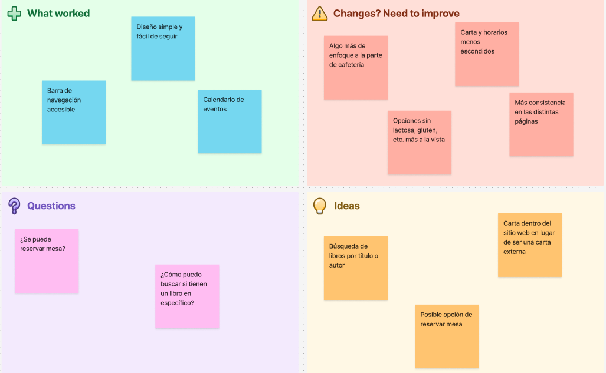
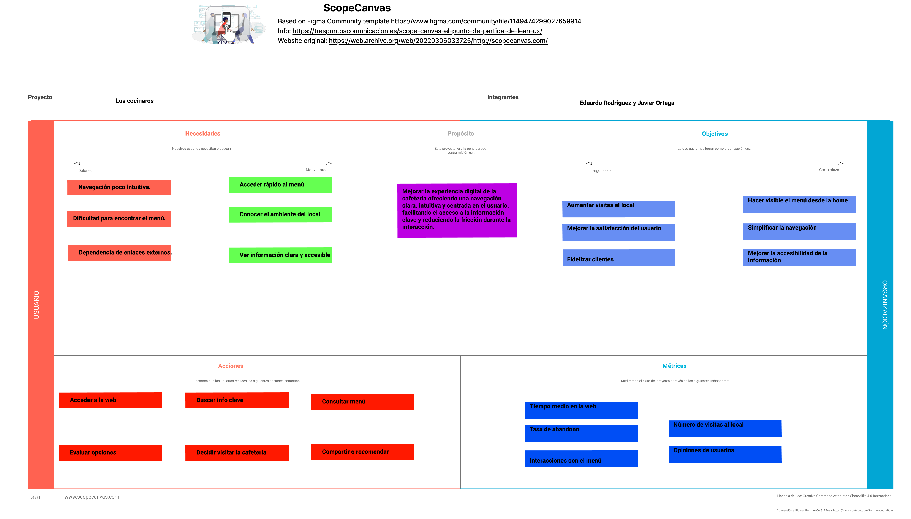
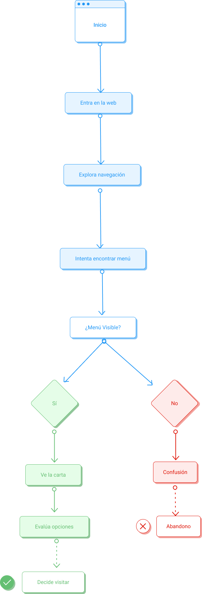

## DIU - Practica2, entregables

Práctica2: Readme.md
Integrantes:  
- Eduardo Rodríguez Hoces  
- Javier Ortega Medina  

Caso de estudio: [La Qarmita](https://laqarmita.es/)
Figma Enlace P2: https://www.figma.com/design/3GMxvI9WsglMRDX02EBSjC/DIU_Toolkit_Framework--2026---Copia-?node-id=0-1&t=yDnZANyoNCObJfzD-1
---

## 1. Inspiración / Case Study

### Idea inicial

> Y si, ¿existiera una plataforma que permitiera descubrir cafeterías buena en Granada, que combinen café de especialidad y experiencias culturales como la lectura?

### Contexto 

> A partir del análisis que realizamos en la práctica 1, detectamos diferentres problemas con la página web de la Qarmita, como la dificutal para acceder al menú o la falta de información clara para los usuarios. 

### Oportunidad

> Podemos mejorar esta experiencia digital en este tipo de cafeterías, por ejemplo: Ofreciendo una navegación más clara, acceso rápido al menú y los horarios y una mejor comunicación de la propuesta de valor del local.

### Usuarios

> Dirigido a personas que buscan un sitio dónde socializar o trabajar, que valoren tanto el la calidad del café como el propio ambiente del local.

### Objetivo

> El objetivo es diseñar una nueva propuesta de interfaz que mejore la experiencia del usuario, solucionando los problemas ya detectados y ofreciendo una interacción más intuitiva. 

---

## 2. REFRAMING/IDEACIÓN

## 2.1 Empathy Map

>El mapa de empatía se ha elaborado a partir de un perfil general de cliente, identificando patrones comunes también relacionados con los usuarios ficticios creados en la práctica anterior.

---

## 2.2 Feedback Capture Grid

---

## 3. Propuesta de Valor (Scope Canvas)

---

## 4. Task Analysis

---

## 5. Arquitectura de la Información

### Estructura del sitio
- Inicio
- Menú
- Reservas
- Eventos
- Contacto

### Descripción
> 

---

## 6. Prototipo (Lo-Fi)

### Bocetos iniciales
> 

---

### Wireframe en Figma
> 

---

### Diseño responsive
> 

---

## 8. Conclusión

> 
>>>> Este fichero se debe editar para que cada evidencia quede enlazada con el recurso subido a la carpeta de la practica. Se pide más detalle técnico en las descripciones de lo que sería el README principal del repositorio y que corresponde a la descripcion del Case Study.
>>>> Termine con la seccion de Conclusiones para aportar una valoración final del equipo sobre la propia realización de la práctica
