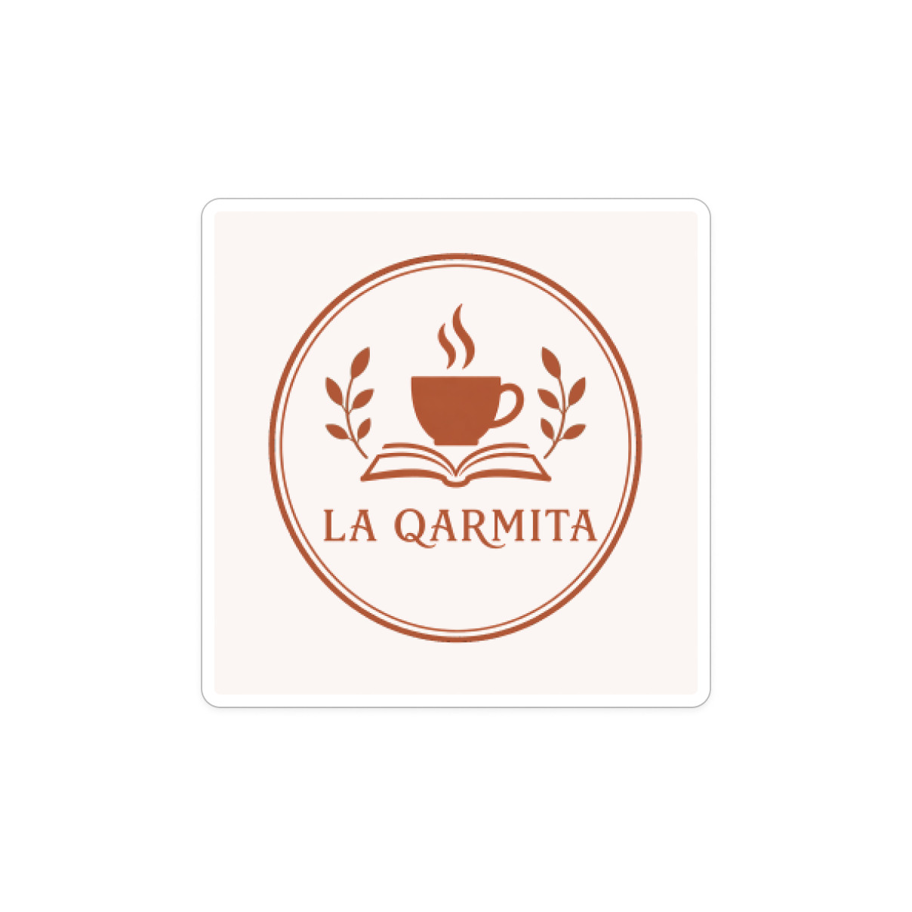

# DIU26
Prácticas Diseño Interfaces de Usuario (Tema: .... ) 

* [Guiones de prácticas](GuionesPracticas/)
* [Guía para crea tu Case Study](Guia_CaseStudy.md)
* Sala de la Fama [DIU Hall of fame](https://github.com/mgea/DIU/tree/master/hall_of_fame) donde se pueden encontrar Case Study destacados de otros años.

### Para los evaluadores
Enlace a la Paǵina Web: [Enlace](https://sphere-fresco-52121333.figma.site)

Más adelante se detalla la página web.

Actualizado: 13/05/2026

## Paso 0 My UX-Case Study
 
Grupo: DIU2_Cocineros.  Curso: 2025/26 

Nombre del Proyecto: **_Case Study_ del sitio web de La Qarmita**

Descripción: 

>>> La Qarmita es una cafetería en el centro de Granada con la particularidad de que también vende libros y promueve la lectura dentro del espacio. En este _case study_, analizamos [el sitio web del establecimiento](https://laqarmita.es) y lo rediseñamos para mejorar la experiencia de los usuarios.

Logotipo: 

Miembros y nombre del equipo:
 * Eduardo Rodríguez Hoces
 * Javier Ortega Medina

----- 
 

## Paso 1. UX User & Desk Research & Analisis 

### 1.a User Reseach Plan
El plan inicial ha sido evaluar la usabilidad del sitio web identificando problemas de navegación y localización de la información relevante. 

### 1.b Competitive Analysis
Para el análisis de competidores, se han escogido otras dos cafeterías:
- Coffee Corner (Sevilla, España), una cafetería con estética similar en otra parte de Andalucía.
- La Finca Roaster (Granada), otra cafetería/productor de café en Granada que ofrece clases de barismo.

En la imagen debajo se proporcionan los resultados del análisis.

Como podemos observar, la Qarmita presenta una experiencia no tan optimizada como con sus competidores, especialmente en aspectos como la accesibilidad de la información y la claridad del diseño. Mientras que otras cafeterías ofrecen menús visibles y navegación más directa, La Qarmita requiere más pasos para acceder a información clave, lo que puede generar fricción en el usuario.

### 1.c Personas
Para la sección siguiente, se han creado dos personas prototípicas de la audiencia objetivo de la cafetería: Laura Jiménez y Hugo Palomares. Sus fichas de personaje son las siguientes.

### 1.d User Journey Map
Para ambas personas creadas, se ha modelado su experiencia visitando la [página web](https://laqarmita.es) de la cafetería. Los resultados se indican abajo.

### 1.e Usability Review
Se ha aplicado el _usability review_ diseñado por [UX For the Masses](http://www.uxforthemasses.com/) al sitio web. La puntuación obtenida ha sido de **65 puntos sobre 100**, en el rango **Moderate**. Todas las respuestas a las preguntas y comentarios al respecto pueden ser vistos en el archivo `Usability-review-template.ods`.

## Paso 2. UX Design  

Después de la fase de investigación de usabilidad, se han empezado a considerar cuestiones para un rediseño de la página.

### 2.a Reframing / IDEACION: Feedback Capture Grid / EMpathy map 
Inicialmente, se han recopilado las ideas más relevantes de cara a lo que necesita el usuario; tanto en un _empathy map_ como en un _feedback capture grid_. Los resultados se detallan en las siguientes figuras. 

### 2.b ScopeCanvas

  

### 2.b User Flow (task) analysis 
Esta sección muestra un acercamiento primerizo a la navegación que se desea tener por el sitio web, en forma de diagrama de flujo.

### 2.c IA: Sitemap + Labelling 
Bajando un poco más el nivel de diseño, se ha realizado un _sitemap_ para organizar las distintas partes de la página a realizar.

### 2.d Wireframes
El último paso ha sido realizar un _wireframe_ de baja fidelidad del sitio web final, el cual puede verse con detalle en `P2/Prototype/Wireframe/`.

 

## Paso 3. Mi UX-Case Study (diseño)
El siguiente paso, una vez se ha obtenido un primer prototipo, es detallarlo más a nivel visual, especificando la paleta de colores, las tipografías, etc. 

### 3.a Moodboard
El diseño visual a alto nivel se ha especificado mediante un _moodboard_ visible en la figura debajo. 

  

### 3.b Guidelines
Lo siguiente que se debe hacer es usar el _moodboard_ como una base para definir el estilo visual de la página más precisamente. Se han declarado pautas de diseño para los **átomos** de la página (botones sencillos, deslizadores, etc.) y las **moléculas** (componentes más complejos como puede ser un _carousel_).

### 3.c Mockup
 
Por último, se han aplicado estas pautas de diseño al _wireframe_ de la práctica anterior, haciendo un diseño de mayor fidelidad en Figma. Se puede ver el resultado en `P3/Layout/`.
 

## Paso 4. Pruebas de Evaluación 
El último paso es transformar el prototipo en un sitio web completo. El sitio web ha sido desarrollado con la ayuda de **Figma Make** en TypeScript con React. Además del enlace al principio del reportaje, se puede ver el código fuente del sitio web en `P4/CodigoLocal/`.
